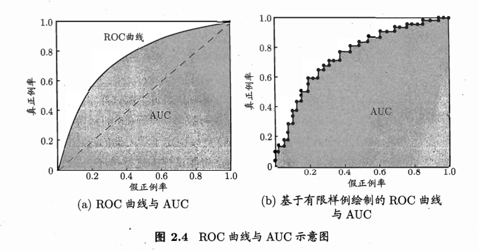

# 告别玄学调参：ROC曲线与AUC，让你明明白白评估模型！

**作者：反卷ccj**

大家好，我是反卷ccj！在机器学习的江湖里，模型训练完了，怎么知道它是个“王者”还是“青铜”呢？评价指标千千万，今天咱们就来聊聊两位重量级嘉宾——ROC曲线和AUC值。它们不仅能帮你更客观地评估分类模型，还能让你在调参时少走弯路，告别“玄学”，拥抱科学！

## 一、模型输出与“及格线”的烦恼

咱们很多分类模型（比如逻辑回归、神经网络），在预测的时候，并不会直接甩给你一个“是”或“否”的答案，而是会给出一个概率值或者一个分数，表示这个样本属于某个类别的“可能性”有多大。比如，模型说A样本有80%的可能是正例，B样本有30%的可能是正例。

那问题来了，到底多少分才算“正例”呢？这就需要我们设定一个“**及格线**”，也就是**阈值（Threshold）**。高于这个线的，我们就认为是正例；低于这个线的，就认为是反例。

这个“及格线”可不是随便划的。
*   划得太高，可能会把一些真正的正例也给“刷掉”了（漏报，FN增加）；
*   划得太低，又可能把一些反例也“误收”进来（误报，FP增加）。

你看，选择一个完美的阈值是不是挺让人头疼的？别急，ROC曲线就是来帮我们解决这个烦恼的。

## 二、ROC曲线闪亮登场：画出模型的“权衡之舞”

ROC曲线，全称是“受试者工作特征”（Receiver Operating Characteristic）曲线。听名字挺高大上，其实它就是一张图，横轴是**假正例率（False Positive Rate, FPR）**，纵轴是**真正例率（True Positive Rate, TPR）**。

*   **真正例率 (TPR)**，也叫灵敏度（Sensitivity）或召回率（Recall）。它表示的是，在所有**实际为正例**的样本中，被我们模型**正确预测为正例**的比例。公式是：
    $TPR = \frac{TP}{TP + FN}$
    （TP是真阳性，FN是假阴性。TPR越高，说明模型找出正例的能力越强，漏网之鱼越少。）

*   **假正例率 (FPR)**。它表示的是，在所有**实际为反例**的样本中，被我们模型**错误预测为正例**的比例。公式是：
    $FPR = \frac{FP}{TN + FP}$
    （FP是假阳性，TN是真阴性。FPR越低，说明模型把反例错当成正例的情况越少，冤假错案越少。）

**ROC曲线是怎么画出来的呢？**
很简单，我们把模型对测试样本的预测得分从高到低排个序。然后，我们从最高分开始，依次把每个得分点作为潜在的阈值（或者说，把阈值从最大逐渐调小）。每改变一次阈值，我们就能得到一对新的(FPR, TPR)坐标点。把这些点在图上标出来，再用线段连起来，就构成了ROC曲线。

**解读ROC曲线：**
*   **左下角 (0,0) 点**：FPR=0, TPR=0。模型把所有样本都预测为反例。
*   **右上角 (1,1) 点**：FPR=1, TPR=1。模型把所有样本都预测为正例。
*   **左上角 (0,1) 点**：FPR=0, TPR=1。这是**完美模型**的理想位置，意味着不犯任何错误，所有正例都被正确识别，且没有任何反例被误判。实际模型通常只能无限接近这个点。
*   **对角线 (y=x)**：从(0,0)到(1,1)的虚线，代表了**随机猜测模型**的性能。如果你的模型ROC曲线在这条线下方，那可能还不如瞎猜呢（或者模型学反了）。
*   **曲线越靠近左上角**，说明模型的性能越好。

ROC曲线的好处在于，它展示了模型在**所有可能阈值下**的性能表现，而不是局限于某一个特定阈值。

## 三、AUC值：给ROC曲线打个“综合分”

光看曲线，有时候两条曲线交叉了，也不好说谁一定更好。这时候，就需要一个量化的指标来“一锤定音”，它就是**AUC（Area Under the ROC Curve）**，即ROC曲线下方的面积。

*   AUC的取值范围是 [0, 1]。
*   **AUC = 1**：完美分类器，对应ROC曲线过(0,1)点。
*   **0.5 < AUC < 1**：优于随机猜测。AUC值越大，通常表示分类器性能越好。
*   **AUC = 0.5**：与随机猜测性能相当（模型没什么区分能力）。
*   **AUC < 0.5**：劣于随机猜测（可能需要检查模型或数据）。

**AUC的概率解释（敲黑板！）**：
AUC值还有一个非常直观的概率解释：它等于**从所有正例中随机抽取一个样本$x^+$，同时从所有反例中随机抽取一个样本$x^-$，学习器对$x^+$的预测得分高于对$x^-$的预测得分的概率**。
简单说，就是 $AUC = P(score(正例) > score(反例))$。
这个解释非常重要，它表明AUC衡量的是模型的**排序能力**——能不能把正例排在反例前面。

**为什么AUC这么受欢迎？**
1.  **阈值无关**：它评估的是模型的整体排序能力，不依赖于特定阈值的选择。
2.  **对类别不平衡不敏感**：相比准确率，AUC在处理类别不平衡的数据集时表现更稳定和客观，因为它分别关注正例和反例各自内部的预测情况（TPR和FPR）。

## 四、深入骨髓：AUC与排序损失 $l_{rank}$ 的“爱恨情仇”

为了更好地理解AUC的“排序能力”的含义，我们得请出另一位朋友——**排序损失（Ranking Loss, $l_{rank}$）**。

排序损失 $l_{rank}$ 是用来衡量模型在“排序”这件事上犯了多少错误的。具体来说，它会考察每一对“正例-反例”样本对 ($x^+, x^-$)：
*   如果模型给正例 $x^+$ 的打分 $f(x^+)$ **低于** 反例 $x^-$ 的打分 $f(x^-)$，那就算模型犯了个“大错”，损失记为1。
*   如果模型给它俩的打分**一样** $f(x^+) = f(x^-)$，那就算模型有点“迷糊”，损失记为0.5。
*   如果正例得分**高于**反例得分，那自然是排序正确，损失为0。

把所有这些“错误”或“迷糊”造成的损失加起来，再求个平均，就是排序损失 $l_{rank}$。用数学公式表达就是（其中$D^+$是正例集合，$D^-$是反例集合，$m^+$和$m^-$分别是它们的数量，$I(\cdot)$是指示函数）：
$$l_{rank} = \frac{1}{m^+ m^-} \sum_{x^+ \in D^+} \sum_{x^- \in D^-} \left( I(f(x^+) < f(x^-)) + \frac{1}{2} I(f(x^+) = f(x^-)) \right)$$
$l_{rank}$ 越小，说明模型把正例排在反例前面的能力越强，排序质量越高。

那么，AUC和 $l_{rank}$ 之间有什么关系呢？它们其实是“一体两面”：
**$AUC = 1 - l_{rank}$**

这个公式告诉我们：
*   AUC衡量的是模型“正确排序”的能力（正例得分高于反例的概率）。
*   $l_{rank}$衡量的是模型“错误排序”的程度。
它俩加起来正好是1。所以，一个模型的AUC越高，它的排序损失就越低，反之亦然。这就从另一个角度解释了为什么AUC能够反映模型的排序性能。

## 五、总结与反卷小贴士

ROC曲线和AUC是评估二分类模型性能非常强大且常用的工具。
*   **ROC曲线**让我们直观地看到模型在不同决策阈值下的TPR和FPR权衡。
*   **AUC**则提供了一个单一的、与阈值无关的数值来量化模型的整体排序能力，并且对类别不平衡问题有较好的鲁棒性。
*   理解AUC与**排序损失 $l_{rank}$** 的关系（$AUC = 1 - l_{rank}$），能帮我们更深刻地认识到AUC衡量的是模型区分正反例的内在能力。

希望通过这篇笔记，大家对ROC和AUC有了更清晰的认识。在“反卷”的道路上，掌握这些评估“利器”，能让我们更高效地迭代模型，做出更明智的决策，而不是陷入无尽的“玄学调参”中。

如果你觉得这篇文章对你有帮助，欢迎点赞、收藏、转发！我们下期再见！